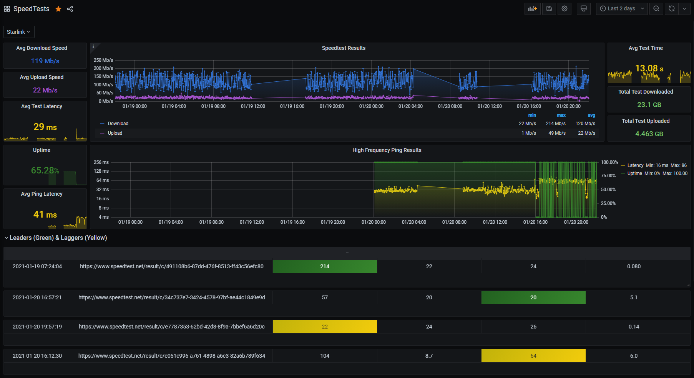

# Speedtest to InfluxDB 2.0

This is a Python script that will continuously run the official Speedtest CLI application by Ookla, takes input from environment variables, formats data and writes it to an InfluxDB database.

This script will allow you to measure your internet connections speed and consistency over time. It uses env variables as configuration. It's as easy to use as telling your Docker server a 1 line command and you'll be set. Using Grafana you can start exploring this data easily. 

I built a Grafana dashboard which has been exported into this repo as `GrafanaDash-SpeedTests.json` to import into Grafana for your convenience.



There are some added features to allow some additional details that Ookla provides as tags on your data. Some examples are your current ISP, the interface being used, the server who hosted the test. Overtime, you could identify if some serers are performing better than others. 

## Configuring the script

The InfluxDB connection settings are controlled by environment variables.

Name | Default | Remarks
--- | --- | ---
`NAMESPACE` | (none))
`INFLUX_DB_URL`  | `http://localhost:8086`
`INFLUX_DB_TOKEN`  | `my-token`
`INFLUX_DB_ORG`  | `my-org`
`INFLUX_DB_BUCKET`  | `my-bucket`
`INFLUX_DB_TAGS`  | (none) | `*` as widcard for all. See below for options
`SPEEDTEST_INTERVAL`  | `5` | minutes
`SPEEDTEST_SERVER_ID`  | (none)| ID List: https://c.speedtest.net/speedtest-servers-static.php
`PING_INTERVAL`  | `5` | seconds
`PING_TARGETS`  | `1.1.1.1, 8.8.8.8 ` | csv of hosts to ping

### Variable Notes
- Intervals are in minutes. *Script will convert it to seconds.*
- If any variables are not needed, don't declare them. Functions will operate with or without most variables. 
- Tags should be input without quotes. *INFLUX_DB_TAGS = isp, interface, external_ip, server_name, speedtest_url*
- NAMESPACE is used to collect data from multiple instances of the container into one database and select which you wish to view in Grafana. i.e. I have one monitoring my Starlink, the other my TELUS connection.
  
### Tag Options
The Ookla speedtest app provides a nice set of data beyond the upload and download speed. The list is below. 

| Tag Name 	| Description 	|
|---	|----	|
| `isp` 	| Your connections ISP 	|
| `interface` 	| Your devices connection interface 	|
| `internal_ip` 	| Your container or devices IP address 	|
| `interface_mac` 	| Mac address of your devices interface 	|
| `vpn_enabled` 	| Determines if VPN is enabled or not? I wasn't sure what this represented 	|
| `external_ip` 	| Your devices external IP address 	|
| `server_id` 	| The Speedtest ID of the server that  was used for testing 	|
| `server_name` 	| Name of the Speedtest server used  for testing 	|
| `server_country` 	| Country where the Speedtest server  resides 	|
| `server_location` | Location where the Speedtest server  resides  |
| `server_host` 	| Hostname of the Speedtest server 	|
| `server_port` 	| Port used by the Speedtest server 	|
| `server_ip` 	| Speedtest server's IP address 	|
| `speedtest_id` 	| ID of the speedtest results. Can be  used on their site to see results 	|
| `speedtest_url` 	| Link to the testing results. It provides your results as it would if you tested on their site.  	|

### Additional Notes
Be aware that this script will automatically accept the license and GDPR statement so that it can run non-interactively. Make sure you agree with them before running.

## Usage

Example docker-compose configuration:

```yml
speedtest:
    container_name: speedtest
    restart: unless-stopped
    build: '.'
    environment:
      - TZ=Europe/Berlin
      - INFLUX_DB_URL=hhttp://localhost:8086
      - INFLUX_DB_TOKEN=my-token
      - INFLUX_DB_ORG=my-org
      - INFLUX_DB_BUCKET=my-bucket
      - INFLUX_DB_TAGS=*
      - SPEEDTEST_INTERVAL=15
      - SPEEDTEST_FAIL_INTERVAL=30
      - SPEEDTEST_SERVER_ID=39047

```

## Credits

This script looks to have been originally written by [aidengilmartin](https://github.com/aidengilmartin/speedtest-to-influxdb/blob/master/main.py), was then forked from [breadlysm](https://github.com/breadlysm/speedtest-to-influxdb) and [qlustor](https://github.com/qlustor/speedtest_ookla-to-influxdb). They did the hard work, I've continued to modify it though to fit my needs.
